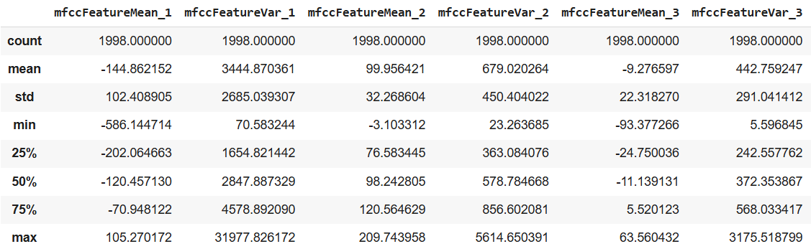
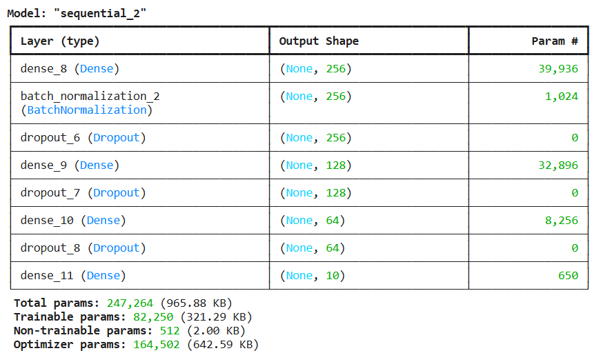
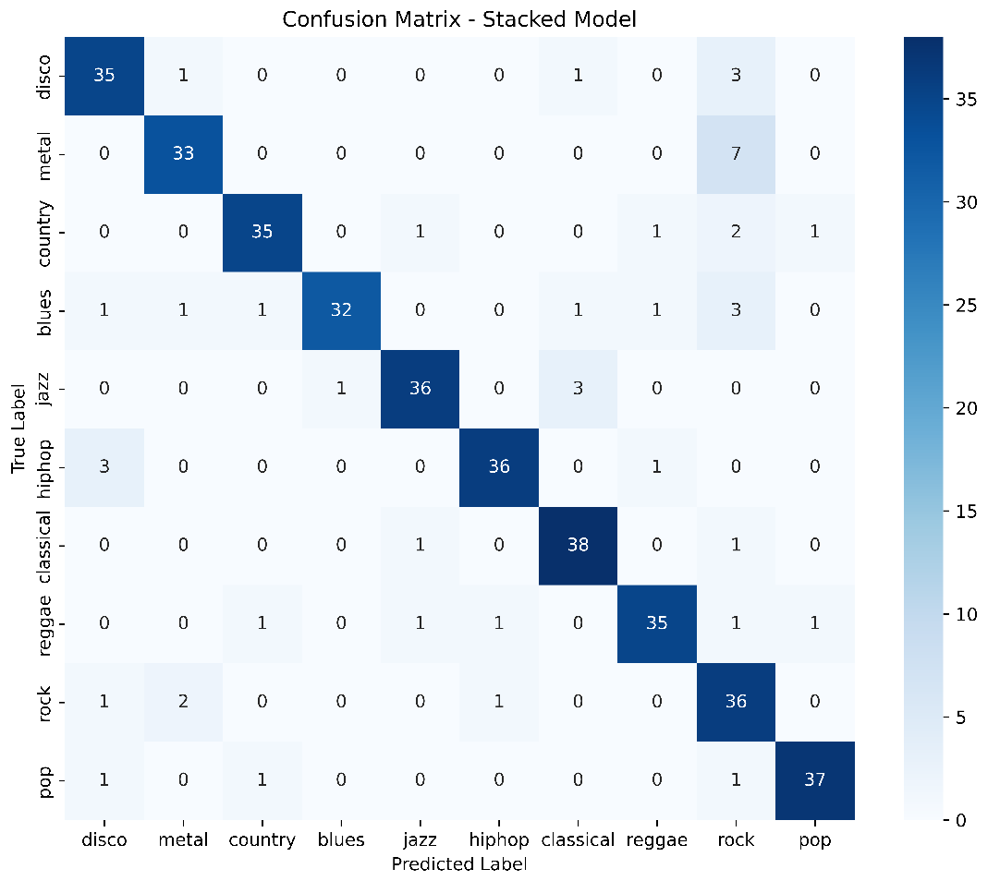

## Genre Prediction using Music Information Retreival
Genre classification can be carried out by latest state of the art multi-modal large language models, but they can be a bit slow and inaccurate as they don’t work on vectors extracted from training sounds.

I have taken to interest different features after being inspired from these techniques. Searching through various data portals such as Kaggle, Google dataset, UCI Machine Learning Repository and many more, I have chosen the GTZAN dataset available on Kaggle. The different genres covered by the dataset are –
• disco
• metal
• country
• blues
• jazz
• hiphop
• classical
• reggae
• rock
• pop

There are 100 audio files of duration 30 seconds each for each genre listed above. The files were collected in 2000-2001. Overall, the dataset is approximately ~1GB in size. Now, these features are extracted as a vector so vector statistics can be used for feature engineering. 

### Feature Engineering
Primary language for analytically purposed – Python and libraries used for feature engineering – Librosa, Pydub and soundfile and utilised numerous features in the following categories:
- Spectral Features
- Rhythm Features
- Feature Manipulation
- Harmomic-Percussive Source Separation
- Time and Frequency

Out of all, 14 features have been selected based on genre based distinctive features using human observation:
• Mel-Frequency Cepstral Coefficients (MFCCs)
• Mel-scaled Spectrogram (melspectrogram)
• Chroma computed from the Constant-Q Transform (chroma_cqt)
• Chroma Energy Normalized Statistics (chroma_cens)
• Chroma computed from the Short-Time Fourier Transform (chroma_stft)
• Spectral Centroid
• Spectral Bandwidth
• Spectral Flatness
• Spectral Rolloff
• Root-Mean-Square (rms)
• Tonal Centroid Features (tonnetz)
• Tempo
• Zero-Crossing Rate
• Harmonic Elements from an audio time-series

### Prediction
After separating each audio file of 30 seconds into 2 files of 15 seconds each, I calculated Average and Variance of each feature and generated a trainable tabular data for the supervised models to train.
Supervised Models Used:
• KNN
• Decision Tree
• Support Vector Classifier
• Gradient Boosting Classifier
• Random Forest Classifier
• XGBoost Classifier
• Light Gradient Boosting Classifier
• Convolutional Neural Network stacked with Best ML model (LGBM)

|   Model           |   Parameters for Tuning                                                                  |   Accuracy   |
|-------------------|------------------------------------------------------------------------------------------|--------------|
|   Decision Tree   |   'criterion': 'entropy', 'max_depth': 20                                                |   0.570      |
|   Random Forest   |   'max_depth': 20, 'n_estimators': 150                                                   |   0.818      |
|   KNN             |   'n_neighbors': 9, 'weights': 'distance'                                                |   0.348      |
|   XGBoost         |   'learning_rate': 0.2, 'max_depth': 3, 'n_estimators': 150, 'objective': 'multiclass'   |   0.883      |
|   LGBoost         |   'learning_rate': 0.2, 'max_depth': 5, 'n_estimators': 150                              |   0.903      |
|   SVC             |   'C': 60, 'gamma': 'scale', 'kernel': 'rbf'                                             |   0.378      |

Here's the Neural Network Model used:

Proposed a stacked model - convolutional neural network will be stacked on top of LGBoost for experimental purposes and their results will be generated using logistic regressor. The idea is to use a meta-model, that takes the predictions of these base models as input features and learns how to combine them in an optimal way. The meta-learner acts as a smart aggregator that balances the two.
Models - LightGBM model and a Neural Network (NN).

Here's the confusion matrix of the proposed stacked model:

The confusion matrix for the stacked model clearly illustrates its high classification performance across all music genres. Most genres such as classical (38/40 correct), pop (37/40), jazz (36/40), country (35/40), reggae (35/40), and hiphop (36/40) exhibit minimal misclassifications.

The stacked model, combining LightGBM and neural networks with a meta-learner, delivered the best performance with a 91.75% accuracy, showcasing the power of model stacking in capturing complex patterns and improving generalization.

This project is part of academic submission for the CSEN 281 Course - Pattern Recognition and Data Mining at Santa Clara University. 